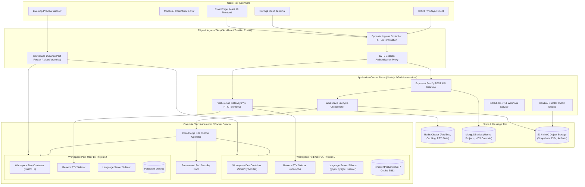
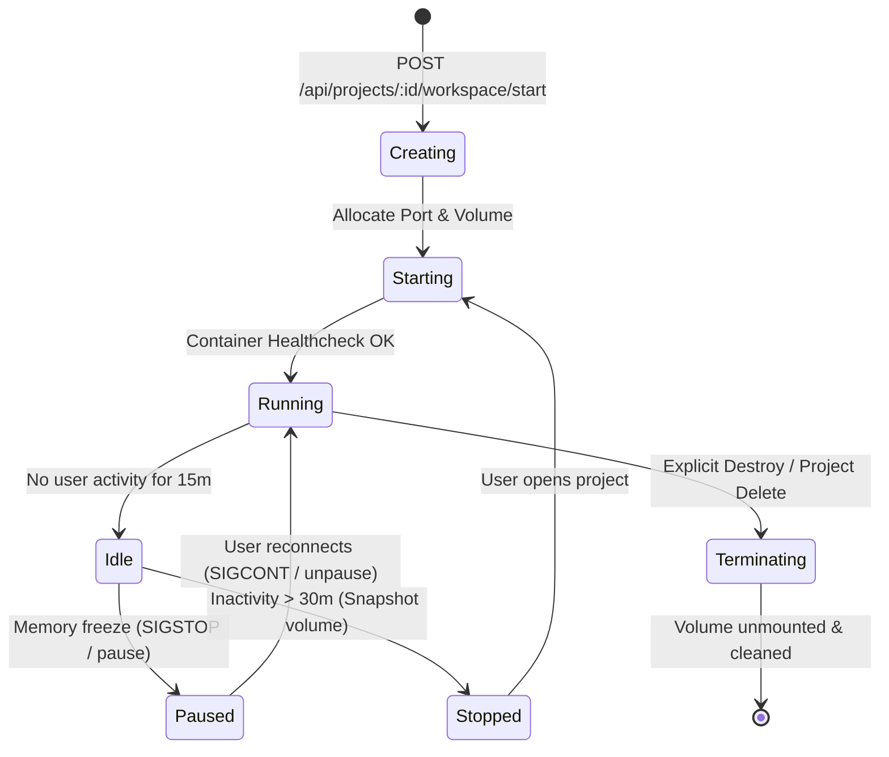
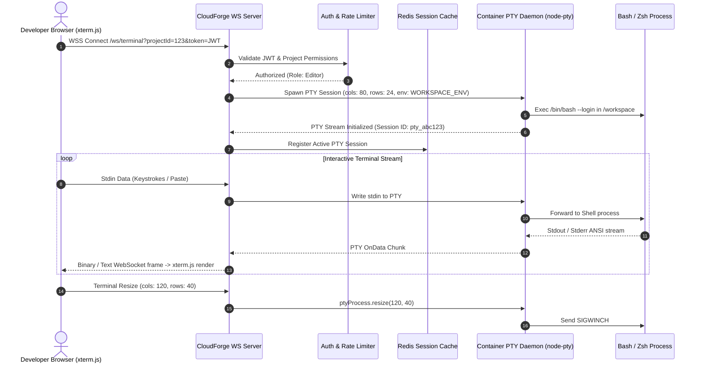
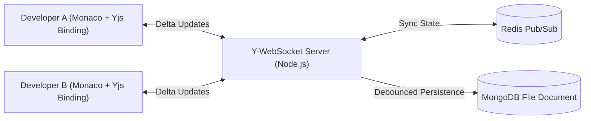
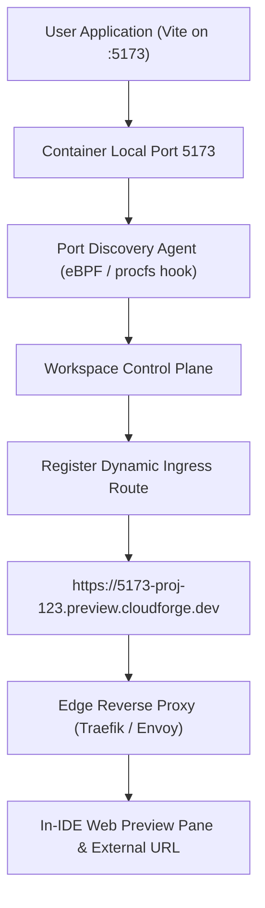
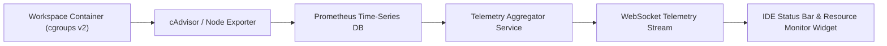
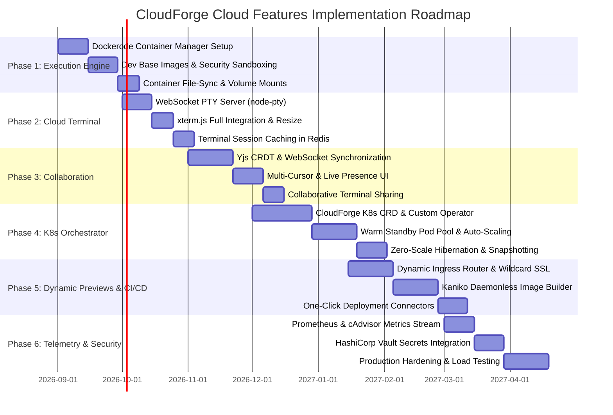

# CloudForge: Cloud Features Implementation & Architecture Plan (Future Roadmap)

> **Document Version:** 1.0.0  
> **Status:** Architecture Blueprint & Implementation Specification  
> **Target Platform:** CloudForge Cloud-Native Development Environment (CDE)  
> **Target Audience:** Engineering Team, DevOps/Cloud Architects, Platform Engineers  

---

## Table of Contents

1. [Executive Summary & Vision](#1-executive-summary--vision)
2. [Target Cloud-Native Architecture Overview](#2-target-cloud-native-architecture-overview)
3. [Phase 1: Containerized Workspace Execution Engine (Docker & Sandboxing)](#3-phase-1-containerized-workspace-execution-engine)
4. [Phase 2: Remote Interactive Cloud Terminal & PTY Streaming](#4-phase-2-remote-interactive-cloud-terminal--pty-streaming)
5. [Phase 3: Real-Time Synchronous Collaboration (CRDT & WebSockets)](#5-phase-3-real-time-synchronous-collaboration)
6. [Phase 4: Kubernetes Workspace Orchestration & Lifecycle Operator](#6-phase-4-kubernetes-workspace-orchestration--lifecycle-operator)
7. [Phase 5: Distributed Storage, Caching & Artifact Management](#7-phase-5-distributed-storage-caching--artifact-management)
8. [Phase 6: Dynamic In-Workspace App Preview & Port Forwarding](#8-phase-6-dynamic-in-workspace-app-preview--port-forwarding)
9. [Phase 7: Cloud CI/CD & Daemonless Container Build Pipelines](#9-phase-7-cloud-cicd--daemonless-container-build-pipelines)
10. [Phase 8: Workspace Observability, Telemetry & Resource Limits](#10-phase-8-workspace-observability-telemetry--resource-limits)
11. [Phase 9: Enterprise Security, RBAC & Secrets Management](#11-phase-9-enterprise-security-rbac--secrets-management)
12. [Phase 10: Multi-Phase Implementation Roadmap & Sprint Breakdown](#12-phase-10-multi-phase-implementation-roadmap--sprint-breakdown)
13. [Technology Stack Selection & Comparison Matrix](#13-technology-stack-selection--comparison-matrix)
14. [Risk Analysis & Mitigation Strategies](#14-risk-analysis--mitigation-strategies)

---

## 1. Executive Summary & Vision

**CloudForge** aims to evolve from a browser-based IDE and file simulation platform into a **production-grade, multi-tenant Cloud Development Environment (CDE)** on par with commercial solutions like GitHub Codespaces, Gitpod, and CodeSandbox, while remaining open-source, lightweight, and cloud-agnostic.

### Core Objectives for Cloud Enablement
- **Instant Workspace Boot (<3 seconds):** Rapid provisioning using warm container/pod pools and volume snapshots.
- **True Multi-Tenant Isolation:** Secure sandboxing per workspace with cgroups v2, gVisor/seccomp, dropped capabilities, and isolated network namespaces.
- **Real-Time Synchronous Collaboration:** Google Docs-style multi-cursor editing, presence awareness, and collaborative terminal sharing.
- **Full Cloud Shell & PTY:** Interactive bash/zsh shell with ANSI color support, process supervision, and command history persistence.
- **Live In-Browser App Previews:** Automatic port detection and reverse proxy subdomains (`https://<port>-<workspace-id>.cloudforge.dev`) with automated TLS.
- **Elastic Scale & Cost Efficiency:** Zero-scale hibernation of inactive workspaces, dynamic Persistent Volume Claim (PVC) snapshotting, and Kubernetes-based auto-scaling.

---

## 2. Target Cloud-Native Architecture Overview

The target production architecture decouples user interface, API gateway, real-time message brokers, orchestration control planes, and isolated execution workers.



---

## 3. Phase 1: Containerized Workspace Execution Engine

### 3.1 Overview
Transform CloudForge from client-side file simulation into a true container-isolated execution platform where user code runs in dedicated Linux containers.

### 3.2 Key Technical Specifications
- **Container Technology:** Docker Engine via `Dockerode` (for single-node deployments) and Containerd/Kubernetes CRI (for cluster deployments).
- **Base Dev Images:** Pre-built, security-hardened Docker images containing standard language runtimes:
  - `cloudforge/runtime-node:20-bookworm` (Node.js 20, npm, yarn, pnpm, TypeScript)
  - `cloudforge/runtime-python:3.11-slim` (Python 3.11, pip, venv, poetry)
  - `cloudforge/runtime-go:1.22-bookworm` (Go 1.22, delve debugger)
  - `cloudforge/runtime-fullstack:latest` (Multi-runtime developer base)
- **Security Sandboxing:**
  - Non-privileged execution: User `forge` (`uid=1000`, `gid=1000`).
  - Dropped Linux capabilities: `--cap-drop=ALL` (selectively whitelist only `CHOWN`, `SETUID`, `SETGID`, `KILL`).
  - Read-only root filesystem with `tmpfs` mounts on `/tmp` and `/run`.
  - Storage mapping: Workspace workspace directory `/workspace` mounted from isolated host volume or network storage.
  - cgroups v2 resource limits enforced:
    - Default CPU limit: `1.5 cores` (`--cpus="1.5"`)
    - Default Memory limit: `2048 MB` (`--memory="2g"`, `--memory-swap="2g"`)
    - PIDs limit: `--pids-limit=256` (prevents fork bombs)
    - Disk I/O throttling: `--device-read-bps`, `--device-write-bps` limits.

### 3.3 Container Lifecycle States


### 3.4 Backend File Sync Engine
- Bidirectional filesystem synchronization between MongoDB metadata and container disk volume using inotify events or virtual filesystem mounts.
- Initial project seeding extracts template code into `/workspace` upon container creation.

---

## 4. Phase 2: Remote Interactive Cloud Terminal & PTY Streaming

### 4.1 Architecture & Flow
The web terminal connects the browser frontend ([`xterm.js`](file:///Frontend/package.json)) to a live Linux Pseudo-Terminal (`pty`) running inside the user's container over secure WebSockets.



### 4.2 Key Features
- **Session Persistence:** Disconnecting the browser does not kill running processes (runs inside a lightweight session daemon or `tmux`). Reconnecting re-attaches to the output buffer stored in Redis.
- **Multi-Tab Terminal:** Support opening up to 4 concurrent terminal tabs per workspace with independent PTY sessions.
- **Command Security & Audit:** Command logging and restricted commands (e.g. blocking access to raw hardware, host sockets).
- **Dynamic Environment Injection:** Seamlessly injecting project environment variables configured in the UI directly into the shell process.

---

## 5. Phase 3: Real-Time Synchronous Collaboration

### 5.1 Real-Time Engine (CRDT via Yjs)
To deliver seamless Google Docs-style pair programming without merge conflicts, CloudForge will adopt **Conflict-Free Replicated Data Types (CRDTs)** using `Yjs` over WebSockets.



### 5.2 Collaboration Features
- **Shared Multi-Cursor & Selection:** Real-time visual cursors with developer name tags and distinct color assignments.
- **Collaborative Workspace Presence:** Live list of active users in the workspace header with avatars and current active file indicator.
- **Terminal Follow Mode (Pair Programming):**
  - **Shared Terminal:** Multiple users can watch or take turns executing commands in the same terminal session.
  - **Read-Only Mode:** Guests and reviewers can view live terminal execution without write permissions.
- **Live File Explorer Synchrony:** Creating, renaming, or deleting a file in one browser immediately reflects across all active collaborator tabs via WebSocket events.
- **Audio / Video & In-App Chat:** Embedded peer-to-peer WebRTC voice/video channel for instant pair-programming calls within the workspace.

---

## 6. Phase 4: Kubernetes Workspace Orchestration & Lifecycle Operator

### 6.1 CloudForge Kubernetes Operator
When scaling across multiple cluster nodes, CloudForge will utilize a custom Kubernetes Operator managing `CloudForgeWorkspace` Custom Resource Definitions (CRDs).

```yaml
apiVersion: orchestration.cloudforge.dev/v1alpha1
kind: CloudForgeWorkspace
metadata:
  name: workspace-proj-8849
  namespace: cloudforge-workspaces
spec:
  projectId: "678e01b2a59c"
  userId: "usr_991823"
  template: "react-typescript"
  resources:
    cpuRequest: "500m"
    cpuLimit: "2000m"
    memoryRequest: "1Gi"
    memoryLimit: "4Gi"
  storage:
    size: "10Gi"
    storageClassName: "cloudforge-fast-nvme"
  inactivityTimeoutMinutes: 15
  autoHibernate: true
  environmentVariables:
    - name: NODE_ENV
      value: "development"
```

### 6.2 Pod Architecture
Each Workspace Pod contains:
1. **InitContainer (`workspace-seeder`):** Clones Git repository or loads file snapshot from S3/MongoDB into `/workspace` volume before start.
2. **Main Container (`workspace-runtime`):** Executes user code, dev servers, compilers, and packages.
3. **Sidecar Container (`pty-lsp-daemon`):** Runs the WebSocket PTY daemon and Language Server Protocol (LSP) multiplexer.
4. **Sidecar Container (`metrics-exporter`):** Lightweight agent collecting container metrics for Prometheus.

### 6.3 Auto-Scaling & Warm Standby Pool
- **Warm Pool (`StandbyPoolManager`):** Maintains a pool of 5–10 pre-initialized, generic standby pods. When a user clicks "Open Project", a warm pod is claimed, its PVC is bound, and the workspace opens in `<1.5 seconds`.
- **Scale to Zero (Hibernation):** When user inactivity exceeds 15 minutes, workspace pods are safely shut down, releasing compute resources while preserving state in the Persistent Volume Claim (PVC).

---

## 7. Phase 5: Distributed Storage, Caching & Artifact Management

### 7.1 Tiered Storage Model
| Tier | Storage Technology | Purpose | Performance / SLA |
| :--- | :--- | :--- | :--- |
| **Hot Cache** | Redis Cluster | Active PTY buffers, presence awareness, rate limits, ephemeral tokens | In-memory (<1ms) |
| **Workspace Disk** | Kubernetes CSI (Ceph / AWS EBS gp3) | Active `/workspace` directories, `node_modules`, build caches | High IOPS (>3000 IOPS) |
| **Document State** | MongoDB Atlas Cluster | User profiles, project metadata, Git commits, branch records, tags | Sub-10ms query time |
| **Cold Storage** | S3 / MinIO Object Storage | Workspace snapshots, exported ZIP archives, build logs, container images | Highly durable (99.999999999%) |

### 7.2 Automated Workspace Snapshots
- Scheduled and on-demand snapshots of workspace files compressed with Zstandard (`zstd`) and stored in S3/MinIO.
- Instant workspace fork/clone capability by duplicating snapshot manifests.

---

## 8. Phase 6: Dynamic In-Workspace App Preview & Port Forwarding

### 8.1 Problem & Solution
When developers start a local development server (e.g. `npm run dev` running Vite on port `5173`), they need to view and interact with their application directly from CloudForge or via a separate browser tab.



### 8.2 Technical Implementation
- **Automatic Port Detection:** A lightweight daemon inspects `/proc/net/tcp` inside the container or watches kernel socket events to detect new listening ports (e.g. `3000`, `5173`, `8000`, `8080`).
- **Dynamic Reverse Proxying:**
  - Traefik or Envoy dynamically routes `https://<port>-<project-id>.<cluster-domain>` to the corresponding workspace container's internal IP and port.
  - Automatic Wildcard SSL/TLS certificate via Let's Encrypt and cert-manager (`*.preview.cloudforge.dev`).
- **Security & Access Modes:**
  - **Private (Default):** Accessible only by authenticated workspace members (secured via session cookies or signed preview tokens).
  - **Public Shareable:** Allows developers to share a preview URL with clients or team members without requiring a CloudForge account.

---

## 9. Phase 7: Cloud CI/CD & Daemonless Container Build Pipelines

### 9.1 Daemonless Container Builds (Kaniko & BuildKit)
Running `docker build` inside Kubernetes traditionally requires insecure `Docker-in-Docker` (DinD) with privileged access. CloudForge will implement daemonless container image builds using **Google Kaniko** and **BuildKit CLI**:
- Builds container images directly from user project Dockerfiles without root or Docker daemon privileges.
- Pushes built images directly to configured container registries (GitHub Packages, Docker Hub, AWS ECR).

### 9.2 One-Click Cloud Deployments
Integrated deployment targets accessible from the CloudForge Deployment Panel:
- **CloudForge Serverless:** Deploy frontend static assets to CDN edge and Node/Python backends to managed serverless containers.
- **External Cloud Connectors:** Direct integrations with Vercel, Netlify, Render, AWS ECS, and Google Cloud Run via API keys and OAuth.
- **Live Pipeline Visualizer:** Visual build pipeline steps (Lint -> Test -> Build -> Deploy) with streaming ANSI logs directly inside the bottom IDE drawer.

---

## 10. Phase 8: Workspace Observability, Telemetry & Resource Limits

### 10.1 Real-Time Metrics Pipeline


### 10.2 Monitored Metrics
- **CPU Utilization:** Percentage of allocated cores used, warning at `>85%`.
- **Memory Consumption:** Live RAM usage vs allocated limit (e.g., `1.2 GB / 2.0 GB`), alerts before OOM-kill (`Out Of Memory`).
- **Disk Usage:** Percentage of Persistent Volume storage utilized.
- **Network I/O:** Real-time ingress/egress transfer rates.
- **Process Table:** Process viewer showing active PIDs, command names, and memory consumption.

---

## 11. Phase 9: Enterprise Security, RBAC & Secrets Management

### 11.1 Role-Based Access Control (RBAC) Matrix
| Permission | Owner | Admin | Editor / Dev | Viewer / Reviewer |
| :--- | :---: | :---: | :---: | :---: |
| **Delete Project** | Yes | No | No | No |
| **Manage Project Secrets & Env** | Yes | Yes | No | No |
| **Manage Collaborators & Roles** | Yes | Yes | No | No |
| **Terminal Read / Write** | Yes | Yes | Yes | No |
| **Terminal Read-Only** | Yes | Yes | Yes | Yes |
| **File Edit & Save** | Yes | Yes | Yes | No |
| **Commit & Push to Remote** | Yes | Yes | Yes | No |
| **View Workspace & App Preview** | Yes | Yes | Yes | Yes |

### 11.2 Secrets & Environment Variables Isolation
- Integration with **HashiCorp Vault** or AWS KMS for envelope encryption of sensitive API keys and database credentials.
- Secrets are securely injected at container runtime using in-memory `tmpfs` mounts or Kubernetes Secrets, preventing credentials from being saved in image layers or commit histories.

---

## 12. Phase 10: Multi-Phase Implementation Roadmap & Sprint Breakdown



### Detailed Sprint Milestones

#### Milestone 1: Containerized Execution & Terminal (Q3 2026)
- **Deliverables:**
  1. `Backend/src/services/containerService.js`: Docker container provisioning, starting, stopping, and resource limiting.
  2. `Backend/src/services/ptyService.js`: Interactive pseudo-terminal bridge over WebSockets.
  3. `Frontend/src/components/workspace/TerminalPanel.tsx`: Full xterm.js integration with theme support, multi-tab terminal, and auto-resize.
  4. Base Docker images for Node.js, Python, and Fullstack templates.

#### Milestone 2: Real-Time Pair Programming (Q4 2026)
- **Deliverables:**
  1. `Backend/src/services/collaborationService.js`: Yjs CRDT synchronization server.
  2. Monaco Editor Yjs binding with multi-user cursors, color palettes, and selection ranges.
  3. Live workspace presence bar and file tree synchronization.

#### Milestone 3: Kubernetes Cloud Orchestrator & Hibernation (Q4 2026 – Q1 2027)
- **Deliverables:**
  1. Kubernetes Custom Resource Definition (`CloudForgeWorkspace`) and Operator written in Go/Node.js.
  2. Dynamic PVC provisioning with persistent network storage (Ceph/EBS).
  3. Warm pod standby pool reducing workspace boot time to `<1.5s`.
  4. Auto-hibernation of idle pods with snapshotting to MinIO/S3.

#### Milestone 4: Live Previews, CI/CD & Deployments (Q1 2027)
- **Deliverables:**
  1. In-container port detection daemon and dynamic Traefik reverse proxy.
  2. In-IDE Web Application Preview tab with refresh, address bar, and external link opening.
  3. Kaniko daemonless container builds and CloudForge One-Click Deployments.

#### Milestone 5: Observability, Enterprise Security & GA (Q2 2027)
- **Deliverables:**
  1. Real-time CPU/RAM/Disk metrics streaming to IDE status bar.
  2. Role-Based Access Control (RBAC) and HashiCorp Vault secrets management.
  3. End-to-end chaos engineering, security penetration testing, and production documentation.

---

## 13. Technology Stack Selection & Comparison Matrix

| Component | Selected Technology | Alternative Evaluated | Rationale for Selection |
| :--- | :--- | :--- | :--- |
| **Container Engine** | **Docker Engine & containerd** | Firecracker MicroVMs | Docker offers broader language ecosystem support, rapid image layering, and universal developer tool compatibility. |
| **Terminal Daemon** | **`node-pty` + `xterm.js`** | WebTTY / ttyd | `node-pty` provides direct process stream access in Node.js, allowing fine-grained authorization, buffering, and resize signals. |
| **Real-Time Sync** | **Yjs (CRDT)** | ShareDB (OT) | Yjs offers superior conflict resolution without central server bottlenecks, native Monaco bindings, and offline resilience. |
| **Cluster Orchestration**| **Kubernetes (K8s)** | Docker Swarm / Nomad | Kubernetes is the industry standard for cloud-native orchestration with rich ecosystem support (KEDA, cert-manager, CSI, Operators). |
| **App Reverse Proxy** | **Traefik Ingress** | NGINX / HAProxy | Native Kubernetes CRD provider support with automatic hot-reloading of routing rules without proxy restarts. |
| **Container Builds** | **Google Kaniko / BuildKit** | Docker-in-Docker (DinD)| Kaniko builds container images inside Kubernetes without requiring privileged container security risks. |
| **Metrics Pipeline** | **Prometheus + cAdvisor** | InfluxDB / Datadog | Standard cloud-native metric format, minimal resource overhead, and seamless integration with Kubernetes cgroups. |

---

## 14. Risk Analysis & Mitigation Strategies

| Risk / Challenge | Severity | Impact | Mitigation Strategy |
| :--- | :---: | :--- | :--- |
| **Container Escape / Privilege Escalation** | High | Malicious user compromises host or other tenants | Enforce non-root execution (`uid 1000`), drop all Linux capabilities, apply seccomp/AppArmor profiles, and isolate network namespaces. |
| **Resource Starvation (Fork Bombs / Crypto Miners)** | High | Runaway processes exhaust cluster memory and CPU | Enforce strict cgroups v2 limits (`--pids-limit=256`, CPU quotas, RAM caps) with automated alerts and kill switches. |
| **Storage Consumption Spikes** | Medium | Large `node_modules` or build caches fill cluster disks | Implement storage quotas on Persistent Volumes (e.g. max 10GB per user) and auto-clean ephemeral caches during hibernation. |
| **Cold Start Latency** | Medium | Slow workspace boot times degrade user experience | Implement a warm-pool pre-warmed pod buffer and cached container image layers on cluster worker nodes. |
| **High WebSocket Connection Churn** | Medium | Server overload during network reconnections | Deploy scalable WebSocket gateways backed by Redis Pub/Sub and horizontal auto-scaling (HPA). |

---

## 15. Next Steps & Immediate Action Items

1. **Review and approve** this architectural plan with stakeholders.
2. **Setup local Docker prototyping branch** (`feature/docker-engine-backend`) to implement `containerService.js` and `ptyService.js`.
3. **Integrate `xterm.js`** inside the existing [Frontend/src/components/workspace/](file:///Frontend/src/components/workspace/) directory.
4. **Deploy a local MinIO / S3 test environment** for artifact and snapshot management.
5. **Establish automated end-to-end testing** for workspace lifecycle events.

---
*Created as part of the CloudForge Cloud-Native Development Environment Project.*
